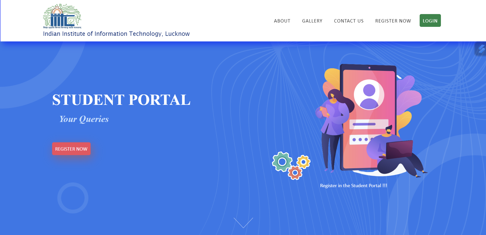

# Student Portal README

## Introduction

Welcome to the Student Portal project! This web application was developed by a team of seven members and is designed to provide students with a user-friendly platform to manage student profile, course details, time tables and schedules.



## Table of Contents

- [Features](#features)
- [Tech Stack](#tech-stack)
- [Installation](#installation)
- [Usage](#usage)

## Features

Our Student Portal offers a range of features to enhance the student experience:

1. **User Authentication**: Users can create accounts, log in, and securely access their personal dashboard.

2. **Dashboard**: A personalized dashboard displaying important information, including upcoming assignments, class schedules, and announcements.

3. **Course Management**: Students can view their enrolled courses, access course materials, submit assignments, and view grades.

4. **Calendar Integration**: Course schedules and important dates are integrated with the calendar to help students manage their time effectively.

5. **Profile Management**: Users can update their profile information, including contact details and profile pictures.

6. **Responsive Design**: The portal is designed to be accessible on various devices, including desktops, tablets, and smartphones.

## Tech Stack

Our Student Portal is built using the following technologies:

- **HTML**: The foundation for structuring the web pages.

- **CSS**: Styling the web pages and ensuring a user-friendly interface.

- **JavaScript**: Enhancing interactivity and functionality.

## Installation

To run the Student Portal on your local machine, follow these steps:

1. Clone the repository to your local machine using `git clone`.

   ```bash
   git clone https://github.com/your-username/student-portal.git
   ```

2. Navigate to the project directory.

   ```bash
   cd student-portal
   ```

3. Open the `index.html` file in your preferred web browser.

## Usage

Once you have the portal running, you can:

- Create a new account or log in if you already have one.
- Explore your personalized dashboard.
- Enroll in courses or access course materials.
- Communicate with instructors and peers.
- Manage your profile and settings.

---
